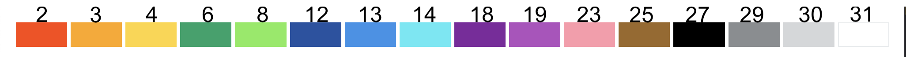

# ForsenPlace Orders

Forsen related orders. Forsen commands, pixels, colors, image processing, total r/place domination. Everything that is somewhat related to Forsen.

## Format

Orders are generated using `reference.py` from the `reference.png` image.

`orders.json` is a list of orders, each order is just a list of three things:

- x-coordinate of the pixel
- y-coordinate of the pixel
- color of the pixel according to reddit index

Reddit color indexing:

